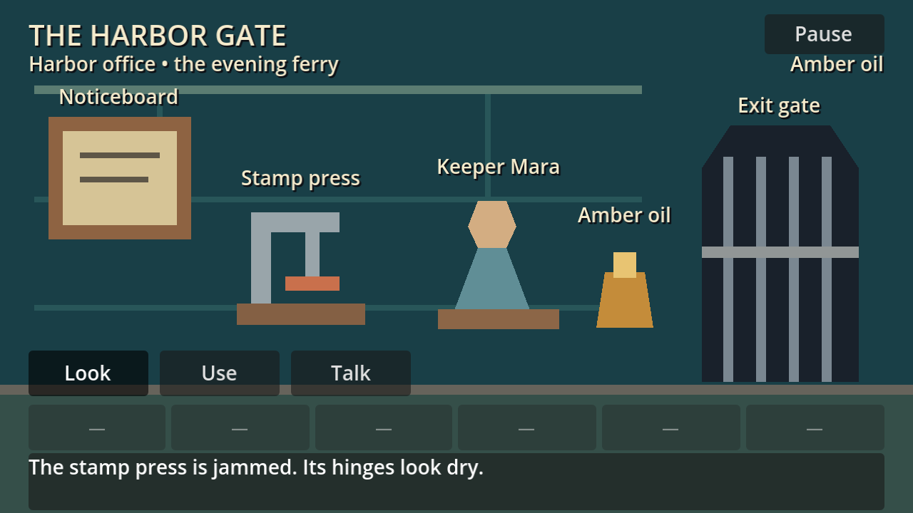
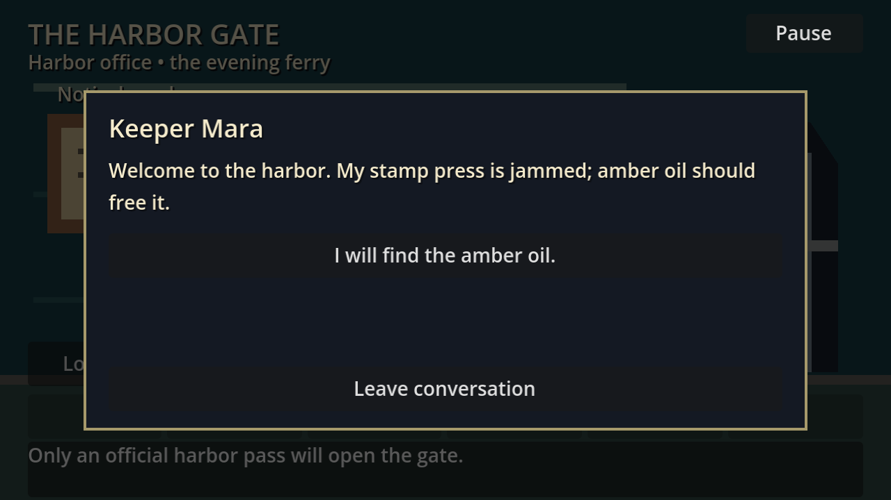
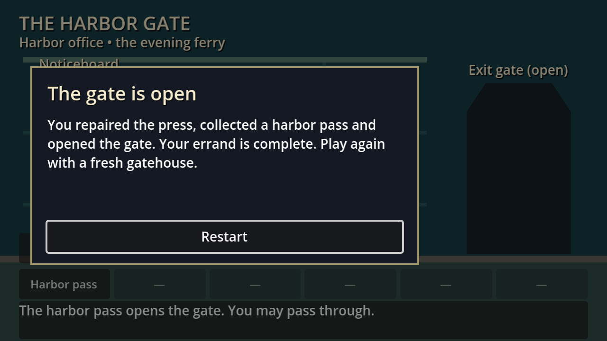

# Acceptance evidence

## Final acceptance — 2026-10-04

The user completed the requested human playtest and reported
“done all good lets wrap this up.” This closes human validation and final
acceptance on a user-reported basis after the request to check completion,
text/clue clarity, wrong-action recovery and fresh restart.

No exact human completion duration or separate new-player timing sample was
supplied. The two-to-four-minute target and under-five-minute route were part
of the requested checklist; no measured human duration is claimed here.
The user's acceptance closes the remaining delivery gates (5.6, 6.2 and 6.6).

## Automated and native checks

Engine: `4.7.2.stable.official.ed1daf0bf`, Compatibility renderer on Apple M2.
Logical viewport: 640×360; native captures: 1280×720.
Reproduction commands are maintained in the [README](../README.md#validate).

| Evidence | Result | Source |
| --- | --- | --- |
| Import | Exit 0, no final script/resource errors | Recorded final implementation checks |
| Behavioral suite | 352 passed, 0 failed, exit 0 | Refreshed before the user's playtest on 2026-10-04 |
| Native capture suite | 367 passed, 0 failed, exit 0 | Recorded source and standalone-reskin runs |
| Native mouse/keyboard route | Complete puzzle, pause/resume and clean restart | Recorded agent computer-use checks |
| MCP launch/debug | Godot 4.7.2; exact source project launched, no startup debug errors | Refreshed before the user's playtest |
| Human playtest | Passed, user-reported | User confirmation above |

The runner covers malformed content and unresolved references, deterministic
hotspot priority, GUI/modal input blocking, six-item capacity failure/retry,
atomic rollback, wrong action ordering, duplicate rewards, one-time completion,
pause/resume, restart from five states and long scrollable text. All script UIDs
are retained. Restricted runs reported macOS log/certificate/editor-settings
access errors; final checks used normal Godot application-data access.

Agent-operated routes previously took 2:01 in the shipped game and 1:02 in the
reskin, including tool/inspection time and with advance puzzle knowledge.
These are historical agent observations, not human timing measurements.

## Standalone reskin

A fresh **The Harbor Gate** copy was created outside the repository without
`.godot/`, symlinks, sibling games or repository-level runtime resources.
It uses a teal backdrop, Keeper Mara, Amber oil, Harbor pass and rewritten
dialogue. Content IDs, hotspot geometry, graph links, conditions and effects
are unchanged. `tests/create_reskin_copy.py` reproduces the copy and audit;
use its newly printed path instead of an old temporary directory.

Fresh import passed without errors/warnings; the copy passed the same
352 behavioral and 367 native-capture checks. A separate agent mouse route
completed and restarted it; MCP reported no debug errors afterward.

The [retained SHA-256 audit](evidence/step06-reskin-audit.json) records matching
runtime script/UID and scene hashes, except the intentionally recolored
background. Hashes were rechecked after import, tests and the native route.

These images are native automated-test captures, inspected separately from the
agent mouse route. Art coverage and candidate-license observations remain in
[asset provenance](../assets/PROVENANCE.md).

## Useful maintenance history

The game was built and validated on 2026-10-03–04. Completed step instructions
and per-step file lists were removed after acceptance; Git retains that history.
The behavior contract remains in the repository's
[OpenSpec requirements](../../openspec/changes/add-point-and-click/specs/point-and-click-slice/spec.md).
OpenSpec is unnecessary to run a copied game.

- `RefCounted.reference()` is a native method; avoid that helper name in loaders.
- Polygon triangulation alone accepts collinear fixtures; validate nonzero area.
- Hotspot labels derive from polygon bounds, independent of vertex ordering.
- Native modal tests must click below wrapped choices when testing blocked room
  input; a choice click is valid UI input, not a failed modal lock.
- Reskin text replacement must target “stamped pass”, not every occurrence of
  “pass”, to preserve feedback such as “You may pass through.”

Original foundation captures remain available:
[room](evidence/step01-room.png) and
[content-error panel](evidence/step01-content-error.png).

Controller support, save/load, extra rooms and downloaded production artwork
are outside the accepted slice. No controller or imported-art acceptance is
claimed. No implementation follow-up remains for this slice.
