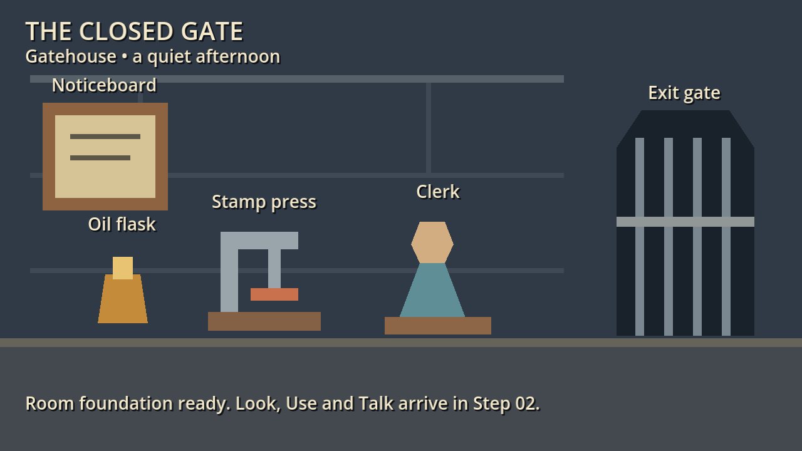
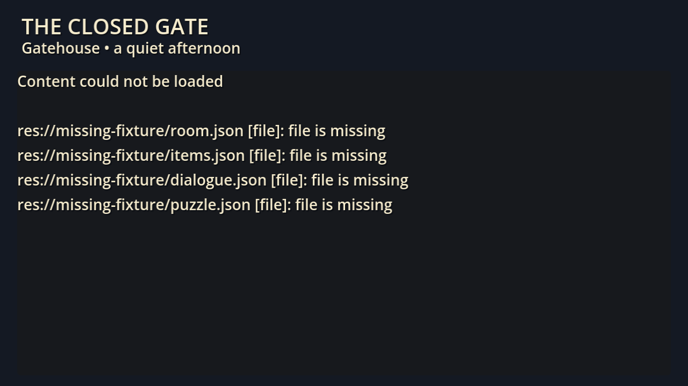

# Acceptance evidence

## Step 01 — 2026-10-03

Foundation complete: standalone static stage, five labeled placeholder hotspots,
project-local JSON definitions and validation before room construction.
OpenSpec tasks 1.1–1.6 are complete; all later tasks remain pending.

Engine: `4.7.2.stable.official.ed1daf0bf`. Compatibility renderer, OpenGL 4.1
on Apple M2. Logical viewport 640×360; native window content 1280×720.
`canvas_items` stretching retains the logical layout and renders text at window
resolution. No shared runtime resources or new dependencies were added.

### Automated checks

Run from `point-and-click/`:

```sh
/Applications/Godot.app/Contents/MacOS/Godot --version
/Applications/Godot.app/Contents/MacOS/Godot --headless --path . --editor --import --quit
/Applications/Godot.app/Contents/MacOS/Godot --headless --path . --script tests/run_tests.gd
/Applications/Godot.app/Contents/MacOS/Godot --path . --script tests/run_tests.gd -- --capture-dir=/tmp/closed-gate-step01-evidence
```

- Import passed with no script/resource errors in the final run.
- Headless suite: **126 passed, 0 failed**. Native suite: **128 passed, 0 failed**;
  the extra two checks save actual native-rendered viewport images.
- Negative fixtures cover malformed JSON, non-object roots, missing files/fields,
  duplicate hotspot/item/speaker/node/rule IDs, invalid value types, unknown keys,
  invalid polygons, local scene constraints, unresolved speaker/node/flag/item/
  target references, unsupported verbs and unknown effects.
- Startup checks confirm invalid content produces no partial room or props and
  shows a file-specific error panel. Valid content builds five independent props
  and disabled, ID-bearing collision regions. Input actions and fixed camera
  framing are checked. No effects or run-state mechanics execute in this step.
- Generated `.gd.uid` files are retained for `scripts/main.gd`,
  `scripts/content_loader.gd` and `tests/run_tests.gd`; no script UID is missing.

The first restricted import encountered macOS application-data/editor-setting
permissions and a script naming collision with `RefCounted.reference()`.
The helper was renamed; subsequent checks ran with normal Godot application-data
access. A collinear polygon fixture exposed a geometry-validation gap, now
rejected with an explicit area check. Final commands above passed.

### Native visual and input evidence

The normal native launch command (`--path .`) displayed the fixed room. Agent
inspection through computer use confirmed readable title, subtitle, all five
labels and foundation status text, with no clipping or off-screen props at the
target size. Native left-click, right-click and Escape left the static room
unchanged, as expected before Step 02 dispatch. This confirms a foundation
input smoke check, not functional verbs, hover names, cancellation or pause UI.
Native launch and test runs reported no project/runtime errors.

The captured native test viewports were separately inspected for room readability
and a readable error panel with no partially displayed stage:





### Independent copy

The whole folder was copied without `.godot/` to the temporary directory
`/var/folders/l1/llh3yrws3q9gmq_bq9cp_klm0000gn/T/closed-gate-step01-tnso91kc/point-and-click`.
Fresh import and headless checks passed there (**126/126**), and the native
project process started with Compatibility rendering and no missing-resource
errors. The final native capture suite also passed in the copy (**128/128**);
its room and error-panel image hashes match the inspected source captures.
The source native window supplied computer-use visual/input evidence; no separate
physical input acceptance is claimed for the copy. All runtime scene paths
resolve within `res://`; repository planning links are not runtime dependencies.
The full isolated-copy completion/reskin route remains Step 06 work.

### Remaining gaps

- Human acceptance and timed playthrough are pending; there is no playable
  puzzle chain in Step 01. Look/Use/Talk, inventory, dialogue, pause, restart and
  completion remain Steps 02–05 work.
- No controller check was performed; controller support is outside this slice.
- CraftPix art remains a researched candidate; no imported-asset or license
  acceptance is claimed. See [provenance](../assets/PROVENANCE.md).
- Later-step acceptance items in DESIGN.md remain unchecked.

## Files changed for Step 01

Only this game and its OpenSpec task checklist changed:

- `point-and-click/.gitignore`
- `point-and-click/README.md`
- `point-and-click/assets/PROVENANCE.md`
- `point-and-click/data/dialogue.json`
- `point-and-click/data/items.json`
- `point-and-click/data/puzzle.json`
- `point-and-click/data/room.json`
- `point-and-click/data/theme.tres`
- `point-and-click/docs/ACCEPTANCE.md`
- `point-and-click/docs/evidence/step01-content-error.png`
- `point-and-click/docs/evidence/step01-content-error.png.import`
- `point-and-click/docs/evidence/step01-room.png`
- `point-and-click/docs/evidence/step01-room.png.import`
- `point-and-click/project.godot`
- `point-and-click/scenes/main.tscn`
- `point-and-click/scenes/room.tscn`
- `point-and-click/scenes/visuals/background.tscn`
- `point-and-click/scenes/visuals/clerk.tscn`
- `point-and-click/scenes/visuals/gate.tscn`
- `point-and-click/scenes/visuals/noticeboard.tscn`
- `point-and-click/scenes/visuals/oil.tscn`
- `point-and-click/scenes/visuals/pass.tscn`
- `point-and-click/scenes/visuals/press.tscn`
- `point-and-click/scripts/content_loader.gd`
- `point-and-click/scripts/content_loader.gd.uid`
- `point-and-click/scripts/main.gd`
- `point-and-click/scripts/main.gd.uid`
- `point-and-click/tests/run_tests.gd`
- `point-and-click/tests/run_tests.gd.uid`
- `openspec/changes/add-point-and-click/tasks.md`
- `point-and-click/docs/DESIGN.md`
- `point-and-click/docs/STEPS.md`
- `point-and-click/docs/steps/01-foundation.md`

Sibling games, root guidance/configuration, OpenSpec requirements, and Step 02–06
guides were intentionally untouched. Git delivery is separate from foundation acceptance.
